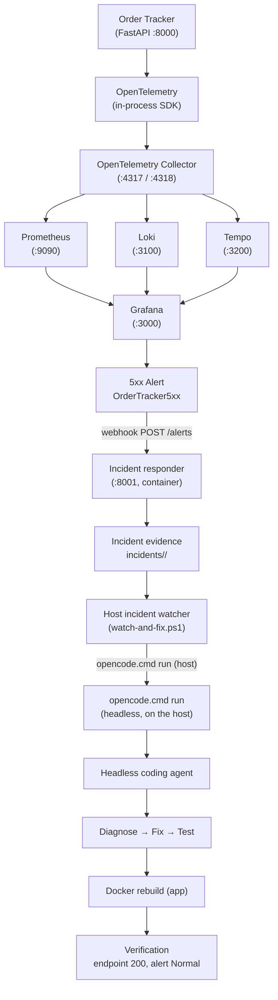

# Order Tracker — DevOps & Observability (DataTalksClub AI Dev Tools Zoomcamp 2026)

Order Tracker is a small FastAPI service for creating orders and checking
their status. This repository contains the complete Homework 4 solution:
the app was instrumented with OpenTelemetry, wired into a full telemetry
pipeline (Collector → Prometheus / Loki / Tempo → Grafana), given a 5xx
alert with a webhook, and given an automated incident-response loop in
which a real headless coding agent investigates and remediates a
controlled failure.

The final objective, demonstrated live in this repo:

**Deploy → Observe → Alert → Investigate → Fix → Verify → Recover**

| Question | What was implemented |
|---|---|
| Q1 — Health check | `GET /healthz` returns `{"status":"ok"}` |
| Q2 — OpenTelemetry instrumentation | Metrics, logs, traces on order lookups (route + status), console export |
| Q3 — Observability stack | Collector + Prometheus + Loki + Tempo + Grafana pipeline and dashboard |
| Q4 — Grafana 5xx alert | `OrderTracker5xx` (5-minute window, `for: 1m`, no-data → OK) |
| Q5 — Incident responder + headless coding agent | Webhook responder, evidence collection, host watcher, `opencode.cmd run` |
| Q6 — Automated remediation and verification | Agent fix (`timedelta`), rebuild, endpoint + alert recovery |

## 1. Project Overview

Order Tracker lets clients register orders (`POST /api/orders`), list them,
look one up (`GET /api/orders/{order_id}`), change its status
(`PATCH /api/orders/{order_id}`), and check service health
(`GET /healthz`). SQLite stores the data; three sample orders are seeded
on first startup. A static page is served at `/`.

This project was built as part of **DataTalksClub AI Dev Tools Zoomcamp
2026, Homework 4 (DevOps and Observability for AI-Built Apps)**. The
homework's purpose is to practice, on a real running system:

- **observability** — seeing inside a running app instead of guessing;
- **telemetry** — emitting signals via OpenTelemetry;
- **metrics** — counters of what happened (how many, which route, which status);
- **logs** — the diary of individual events;
- **traces** — following one request across every step it takes;
- **Grafana dashboards** — one screen for all three signals;
- **alerting** — turning a metric condition into Normal / Pending / Firing states;
- **automated incident response** — a webhook that starts an investigation by itself;
- **headless coding-agent remediation** — a real agent that diagnoses, fixes,
  tests, rebuilds, and verifies, then the alert recovers on its own.

## 2. Architecture



Critical boundary: **OpenCode runs on the Windows host** (via
`incident-response/watch-and-fix.ps1`), **not inside the responder Docker
container**. The container has no repo access and cannot edit code; it
receives webhooks, saves evidence, and launches its bundled investigator.
The host watcher — where the repo lives — is what starts the genuine
`opencode.cmd run` coding-agent workflow.

## 3. Technology Stack

Every item below is actually present in this repository / pipeline:

- **Python** (3.11+ required, 3.12 in containers) — app and responder language
- **FastAPI** — Order Tracker API (`app/main.py`) and responder API
  (`incident-response/app.py`)
- **Uvicorn** — ASGI server for both services
- **Docker + Docker Compose** — all services run via `compose.yaml`
- **OpenTelemetry** (API + SDK + OTLP exporter) — in-process
  instrumentation of Order Tracker
- **OpenTelemetry Collector** (`otel/opentelemetry-collector-contrib`) —
  receives OTLP on 4317/4318, fans out to backends
- **Prometheus** — metrics backend (scrapes the Collector's `:8889`)
- **Loki** — log backend (receives OTLP/HTTP from the Collector)
- **Tempo** — trace backend (receives OTLP gRPC from the Collector)
- **Grafana** — dashboards, log/trace exploration, unified alerting
- **PowerShell** — `incident-response/watch-and-fix.ps1` host watcher
- **OpenCode** (`opencode.cmd run`) — headless coding agent on the host
- **pytest** — `tests/test_api.py` (3 tests)
- **uv** — dependency and lockfile management (`pyproject.toml`, `uv.lock`)

## 4. Order Tracker Application

The FastAPI app (`app/main.py`) exposes:

| Method | Path | Purpose |
|---|---|---|
| GET | `/` | Static web page |
| GET | `/healthz` | Database health check → `{"status":"ok"}` |
| GET | `/api/orders` | List orders |
| POST | `/api/orders` | Create an order (201) |
| GET | `/api/orders/{order_id}` | Check one order (the instrumented lookup) |
| PATCH | `/api/orders/{order_id}` | Change order status |

Normal behavior: creating, looking up, and updating `standard` orders
returns 200/201; looking up an unknown id returns 404
(`test_missing_order` covers this).

The intentionally triggered incident uses **`express-1002`** (seeded as
`Sam` / `Headphones` / `express` / `preparing`): looking it up exercised
the express delivery-date code path and returned **HTTP 500** until fixed.
It is the reproducible failure case for the incident-response
demonstration — a controlled homework incident, not a production outage.

## 5. The Original Incident

The bug is in `order_detail()` (`app/main.py`):

```python
estimated_at = placed_at.replace(day=placed_at.day + 2)
```

`datetime.replace(day=...)` sets a calendar day; it does not do date
arithmetic. The seed creates `express-1002` with
`created_at = now.replace(day=1) - timedelta(days=1)` — the last day of
the previous month. When that date is e.g. **2026-09-30**
(`placed_at.day = 30`), the code attempts:

```python
placed_at.replace(day=32)   # there is no 32nd day
```

Python raises:

```
ValueError: day is out of range for month
```

The exception escapes `get_order()`, the OTEL middleware records it as a
500, and the client receives `HTTP 500 Internal Server Error`. Standard
orders never touch this branch (the estimate is computed only when
`priority == "express"`).

The fix (one line):

```python
estimated_at = placed_at + timedelta(days=2)
```

`timedelta` is real date arithmetic: 2026-09-30 + 2 days = 2026-10-02,
correct across month boundaries.

## 6. OpenTelemetry Instrumentation

`app/main.py` sets up all three signals at import:

- **Traces** — `TracerProvider` with console + OTLP/gRPC exporters; one
  span per request (`{METHOD} {route}`) plus a child `order.lookup` span
  carrying `order.id` and the response status.
- **Metrics** — `http.server.request.count` (counter) and
  `http.server.request.duration` (histogram), each tagged with
  `http.method`, `http.route`, and `http.response.status_code`. Exported
  to the console every second (for `docker compose logs app`) and to the
  Collector over OTLP every 5 seconds.
- **Logs** — an OTEL `LoggerProvider` (console + OTLP) bridged to stdlib
  logging via `LoggingHandler`, so every `logger.info` line also becomes
  an OTEL log record shipped to Loki.

An HTTP middleware records every request, including crashes: the
exception path still increments the counter with status `500`.

Routes are **normalized** by `_route_template()` (`app/main.py`): `/`,
`/healthz`, `/api/orders`, and **`/api/orders/{order_id}`** for any
order id. Normalization matters because Prometheus creates one time
series per label combination — grouping by `/api/orders/{order_id}`
gives a handful of useful series (per status code), whereas raw paths
(`/api/orders/standard-1001`, `/api/orders/express-1002`, …) would
explode cardinality with one series per order id.

Verified live for both outcomes:

- success: `GET /api/orders/standard-1001` → metric
  `{http_route="/api/orders/{order_id}", http_response_status_code="200"}`;
- failure: `GET /api/orders/express-1002` (pre-fix) → same route with
  `"500"`, plus an ERROR trace carrying the `ValueError`.

## 7. Observability Pipeline

- **OpenTelemetry (in app)** — instruments code and exports OTLP/gRPC to
  `http://otel-collector:4317` (`OTEL_EXPORTER_OTLP_ENDPOINT`).
- **OpenTelemetry Collector** (`otel-collector-config.yaml`) — receives
  OTLP on 4317 (gRPC) / 4318 (HTTP) and forwards along three pipelines:
  metrics → Prometheus exporter (`:8889`) + debug; logs → Loki
  (OTLP/HTTP) + debug; traces → Tempo (OTLP/gRPC) + debug.
- **Prometheus** (`prometheus.yml`, 5s scrape of `otel-collector:8889`) —
  stores numeric time series such as
  `http_server_request_count_total{http_route,http_response_status_code}`.
- **Loki** (`loki-config.yaml`) — stores log lines, queryable by labels
  like `{service_name="order-tracker"}`.
- **Tempo** (`tempo.yaml`) — stores distributed traces, viewable per
  trace id.
- **Grafana** — provisioned Prometheus/Loki/Tempo datasources, the
  dashboard, and unified alerting (all files under `grafana/`).

The three signals complement each other:

- **Metrics → What is happening?** ("the 5xx rate on order lookups is 0.07/s")
- **Logs → What happened?** ("`GET /api/orders/express-1002` → 500 at 12:44:19")
- **Traces → Where did the request fail?** (the `order.lookup` span with
  the `ValueError` and exact code line)

## 8. Grafana Dashboard

`grafana/dashboards/orders-dashboard.json` (uid `order-tracker-requests`,
title “Order Tracker - Requests and Errors”, provisioned read-only) has
three panels:

1. **Request counts by route and status** (Prometheus):
   `sum by (http_route, http_response_status_code)
   (rate(http_server_request_count_total[1m]))`
2. **Server errors (5xx)** (Prometheus):
   `sum(rate(http_server_request_count_total{http_response_status_code=~"5.."}[1m]))`
3. **Recent order-tracker logs** (Loki): `{service_name="order-tracker"}`

During the incident, panel 2 rose with the `express-1002` 500s while
panel 1 split traffic by route/status and panel 3 showed the matching
500 log lines — the same failure visible as a number, a diary entry, and
(clicking through to Tempo) a trace.

No screenshots are stored in this repository.

## 9. Grafana 5xx Alert

Rule **`OrderTracker5xx`**
(`grafana/provisioning/alerting/order-tracker-alerts.yaml`,
uid `order-tracker-5xx`, folder “Order Tracker”):

- **Detects:** any server-side error on the normalized lookup endpoint:
  `sum(rate(http_server_request_count_total{http_route="/api/orders/{order_id}",http_response_status_code=~"5.."}[5m]))`.
  The `5..` matcher covers 500–599; 4xx (e.g. the 404 from
  `standard-1002`) can never match it.
- **Evaluation logic:** A (Prometheus range query, last 300s) → C
  (**reduce** `last` of A) → D (**math** `$C > 0`), condition D.
- **Timing:** group evaluation every `30s`, `for: 1m` (must stay true for
  a minute → Fir
...[truncated 15820 chars]
